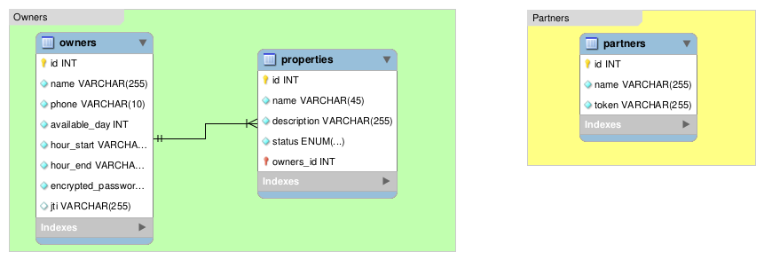

# Homie Test

> This is the `Homie` engineering test for the backend position. The goal of the test is to create an API to retrieve the
> information of the different properties published for rental purposes. As mentioned in the test description, `Homie`
> works with different partners, like `Metros Cubicos`, `Inmuebles24`, `Segundamano`.

## Built With

- `Ruby v2.7.2`
- `Rails v6.1.3`
- `PostgreSQL`, `devise-jwt`, `dotenv-rails`, `rubocop`, `jbuilder`

## Live Demo

[Live Demo Link](https://livedemo.com)

## Getting Started

### Homie instructions

##### Instructions

- Design and make an API that validates a token to retrieve properties with the `published status`. 
- Allow `create`, `read`, `update` and `delete` for each property.

##### Considerations

- Each partner may require different information on the properties listed.
- The owner availability could be any day from `Monday` to `Sunday`, from `8 am` to `8 pm`.

##### Main data to retrieve

- `Name`
- `Description`
- `Rental Price`
- `Owner Name`
- `Owner Phone`
- `Owner Availability`
- `Status`
    * `published`
    * `available`
    * `deleted`

### Development Plan

The `API` will be separated into two different modules to meet the project requirements. The first module will be the
`Owners`, where the `Create`, `Read`, `Update`, and Delete features will be included. The second module will be the
`Partners`, where the token validation feature will be implemented for all the external incoming requests.

#### Owners

This module is intended to `Create`, `Read`, `Update` and `Delete` properties. To secure access to the right property
owner, a basic authentication system is suggested.

- Features
  * `Authentication`, in order to warranty access to the right owner to the properties information, a basic authentication
    system is suggested. This feature will be used to recollect the owner information.
  * `Create`, this feature will be available for registered owners and will be used to create new property records.
  * `Update`, this feature will be available for registered owners and will be used to update existing property records.
  * `Read`, this feature will be mainly available for registered owners and will be used to retrieve existing property records.
    A variant of this feature will be available for the `partners` (check partners description for more information).
  * `Delete`, this feature will be available for registered owners and will be used to implement a `soft-delete` feature
    by changing the property status to `deleted`.
    
- Data Models
  * `Owner`, this model will hold the owners data (name, phone, availability) and it will be related to the Property model
    through a `1:n` relationship.
  * `Property`, this model will hold the properties data (name, description, rental price, status) and it will belong to
    the owner model.
    

#### Partners

This module is intended to warranty access to the `published` properties to the different partners through a validation
token.

- Features
  * `Partner Registration`, this feature will be used to register different applications as `partners` of the API and
    issue a unique token for each one of them.
  * `Property fetch`, this will be a variant of the `Read` feature, to warranty access to the information only to the
    registered partners by validating the token issued after the partner registration.

- Data models
  * `Partners`, this model will hold the partner information, and will be used to generate an access token to the API
    records.
    
    
### Database Model

**To get a local copy up and running follow these simple example steps.**

### Prerequisites

If you want to get a local copy of this project, make sure you have installed the following in your local environment.
- `Git`
- `Ruby v2.7.2` or greater
- `Rails v6.1.3`
- `PostgreSQL`

### Setup

Clone the project by running any of the following commands:
- SSH: `git clone git@github.com:oscardelalanza/h-test.git`
- HTTPS: `git clone https://github.com/oscardelalanza/h-test.git`
- GitHub CLI: `gh repo clone oscardelalanza/h-test`
- ZIP: [Download](https://github.com/oscardelalanza/h-test/archive/feature/planning.zip)

### Install

- Run the command `bundle install` to install the required gems.
- Run the command `rails db:create` to create the database.
- Run the command `rails db:migrate` to execute the required database migrations.
- Run the command `rails db:seed` to seed the database.

### Usage

### Run tests

- Start the test suite by running the command `rails test`

### Deployment

- Start the development server by running the command `rails server`

## Authors

👤 **Oscar De La Lanza**

- Github: [@oscardelalanza](https://github.com/oscardelalanza)
- Twitter: [@oscardelalanza](https://twitter.com/oscardelalanza)
- Linkedin: [Oscar De La Lanza](https://www.linkedin.com/in/oscardelalanza/)

## 🤝 Contributing

Contributions, issues and feature requests are welcome!

Feel free to check the [issues page](https://github.com/oscardelalanza/h-test/issues).

## Show your support

Give a ⭐️ if you like this project!

## 📝 License

This project is [MIT](lic.url) licensed.